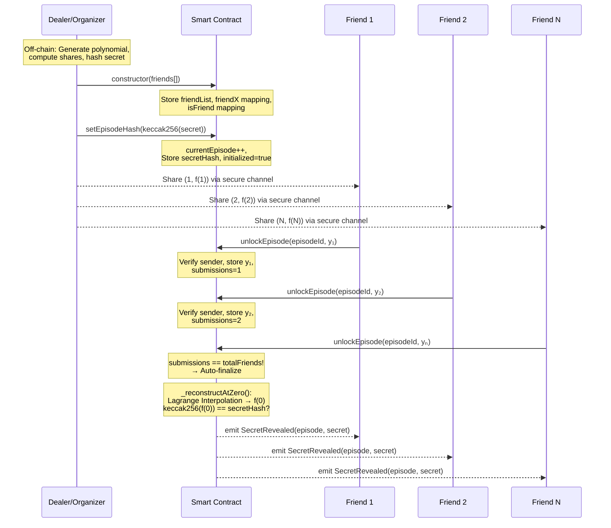

### Lifecycle Overview

### Data Flow by Function

| Step | Function | Caller | Inputs | State Changes | Outputs |
| :--- | :--- | :--- | :--- | :--- | :--- |
| **Deploy** | `constructor` | Organizer | `address[] friends` | `friendList`, `friendX[addr]=i+1`, `isFriend[addr]=true` | Contract deployed |
| **Lock** | `setEpisodeHash` | Organizer | `bytes32 secretHash` | `currentEpisode++`, `episodes[id]` initialized | `EpisodeHashSet` event |
| **Submit** | `unlockEpisode` | Friend | `episodeId`, `y` | `hasSubmitted=true`, `submittedY[id][addr]=y`, `submissions++` | `ShareSubmitted` event |
| **Finalize** | `_finalizeEpisode` | Auto-triggered | Internal | `reconstructedSecret=f(0)`, `secretRevealed=true` | `SecretRevealed` event |

### Reconstruction Math (`_reconstructAtZero`)

For each friend $i$, compute the Lagrange basis polynomial evaluated at $x=0$:

$$L_i(0) = \prod_{j \neq i} \frac{0 - x_j}{x_i - x_j} \pmod{p}$$

Then reconstruct: $f(0) = \sum_{i=1}^{n} y_i \cdot L_i(0) \pmod{p}$

Division in $\mathbb{Z}_p$ is done via **Fermat's Little Theorem**: $a^{-1} \equiv a^{p-2} \pmod{p}$, implemented in `_invMod` → `_powMod` using binary exponentiation.

---

## Threat Analysis & Attack Surface

### 🔴 Critical: Front-Running / MEV Attack

Shares are submitted as **plaintext transactions**. When the 6th friend broadcasts their transaction, but *before* it is mined:
1. A MEV bot or miner can read the pending `y` value from the mempool.
2. Combined with the 5 shares already on-chain, they can reconstruct the secret off-chain.
3. The attacker learns the episode key **before** the group does.

> [!CAUTION]
> This is the most serious vulnerability. The secret is effectively leaked to anyone watching the mempool once the last share is submitted. **Mitigation**: Use a commit-reveal scheme for share submission (submit `keccak256(y)` first, then reveal `y` in a second transaction).

### 🟠 High: On-Chain Share Visibility

All submitted `y` values are stored in `submittedY` and emitted via `ShareSubmitted` events. After $n-1$ shares are on-chain, any observer only needs **one more share** to reconstruct the secret. This information leakage is inherent to the current design.

**Mitigation**: Encrypt shares with a shared group key, or use zero-knowledge proofs to verify shares without revealing them.

### 🟡 Medium: Dealer Trust (Single Point of Failure)

The Dealer/Organizer:
- Knows the secret before anyone else.
- Generates all shares off-chain — friends cannot verify the shares are correctly generated.
- Could distribute wrong shares, causing `ReconstructionMismatch` and permanently blocking an episode.

> [!WARNING]
> The contract trusts the Dealer completely. There is no on-chain mechanism to verify that shares were generated from a valid polynomial. A malicious Dealer can sabotage any episode.

### 🟡 Medium: Denial of Service (n-of-n Deadlock)

Since the scheme requires **all** $n$ friends, any single friend can permanently block an episode by:
- Refusing to submit their share.
- Losing their private key or device.
- Submitting a deliberately wrong share (causes `ReconstructionMismatch` revert).

The README acknowledges this. **Mitigation**: Implement a $t$-of-$n$ threshold scheme (e.g., 4-of-6).

### 🟢 Low: Gas Exhaustion on Finalization

The last friend to submit pays the gas for Lagrange Interpolation across all $n$ friends, which involves $n$ modular exponentiations ($\approx 256$ iterations each). For $n=6$, this is ~7,680 `mulmod` operations. On Sepolia this is fine, but on mainnet this could cost significant gas.

### ✅ Not Vulnerable

| Attack | Why Safe |
| :--- | :--- |
| **Reentrancy** | No external calls are made during state changes |
| **Integer overflow** | Solidity ^0.8.x has built-in overflow checks; `mulmod`/`addmod` are native opcodes |
| **Replay across episodes** | `hasSubmitted` is per-episode; different episodes have different secrets and shares |
| **Unauthorized submission** | `onlyFriend` modifier + `friendX[msg.sender]` enforcement |
